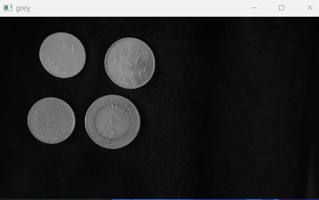
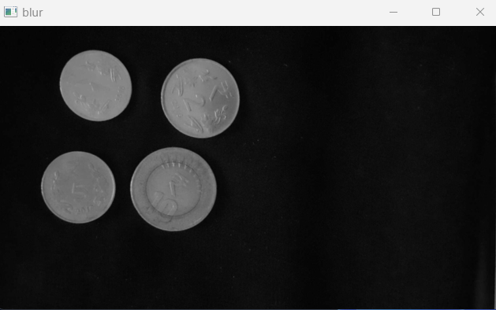
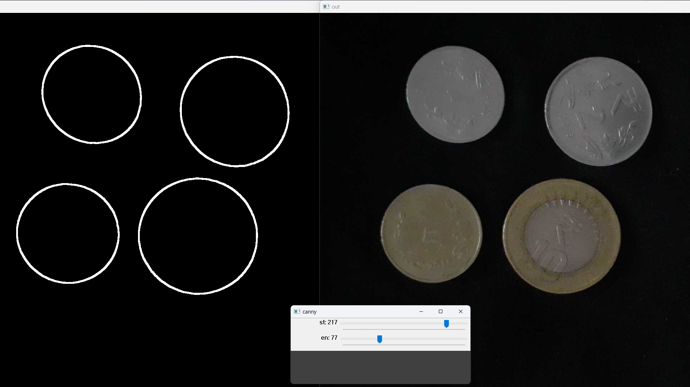
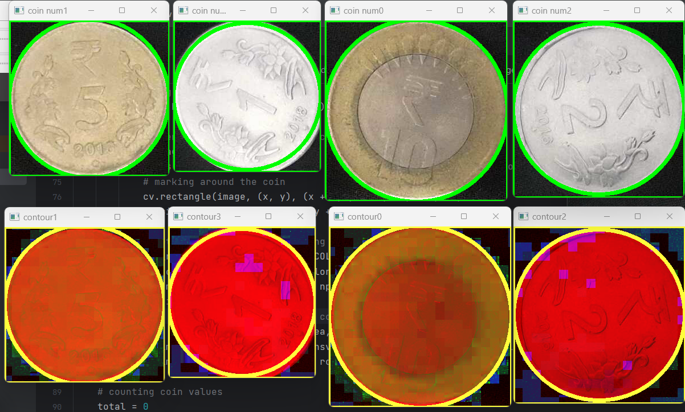
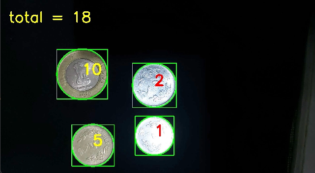

## Coin counter 

It's a small project using opencv and python for counting coin value and returning the total amount.  
The size and color of coins are the key component to differentiate between them.

## Drawbacks
➡️ Camera should be set to a certain angle for the whole time

➡️ Lighting conditions might affect in detection of coins

➡️ If coins are overlapped or in contact might change the expected result

➡️ We need to edit the code again, whenever coins sizes are getting changed (usually when releasing new coins by the authorities).

   

      
## Steps 
      
   

1. Creating video
2. Pre-processing the image.
   1. Convert to greyscale image [[1]](https://docs.opencv.org/3.4/d8/d01/group__imgproc__color__conversions.html#ga397ae87e1288a81d2363b61574eb8cab)

      

   2. Gaussian Blur to smoothen the image [[2]](https://docs.opencv.org/3.4/dc/dd3/tutorial_gausian_median_blur_bilateral_filter.html)

            

   3. Canny Edge detection to detect the edges [[3]](https://docs.opencv.org/3.4/da/d22/tutorial_py_canny.html)

      

   4. Dilation to thicken the edges [[4]](https://docs.opencv.org/4.x/d9/d61/tutorial_py_morphological_ops.html)
   5. Morphological operation to close the discontinuity [[5]](https://docs.opencv.org/4.x/d9/d61/tutorial_py_morphological_ops.html)

      

3. Finding Contours [[6]](https://docs.opencv.org/3.4/d4/d73/tutorial_py_contours_begin.html).
4. Differentiating coins by size[[7]](https://docs.opencv.org/3.4/dd/d49/tutorial_py_contour_features.html) and color[[8]](https://docs.opencv.org/4.x/df/d9d/tutorial_py_colorspaces.html).

      under high light condition
   
      
      
      under low light condition
      
      

      
6. Counting the values of the coin and displaying it[[9]](https://docs.opencv.org/4.x/dc/da5/tutorial_py_drawing_functions.html).

     
  

### Note 
Thresholds in Canny, HSV values, contour area etc are tunable parmaetrs. Some `helper functions` are provided to find these values, please tune those according to the situations
